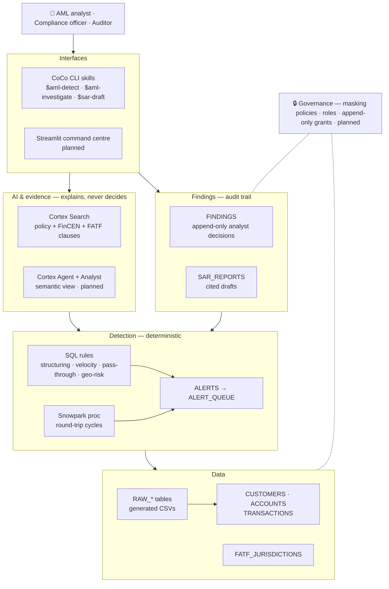
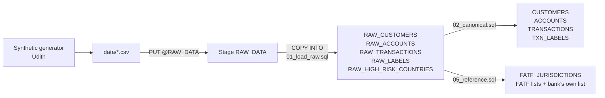
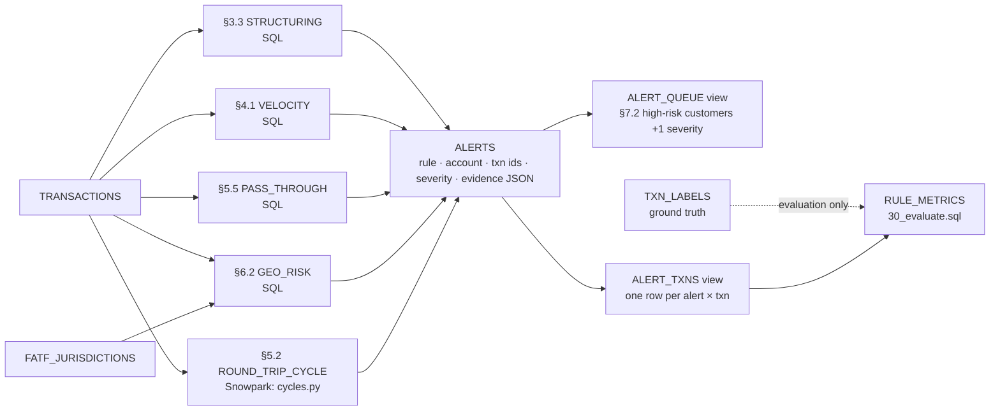
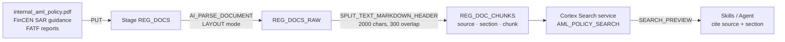
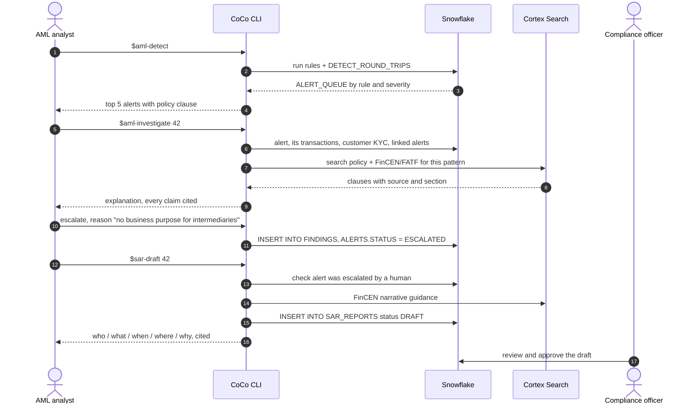
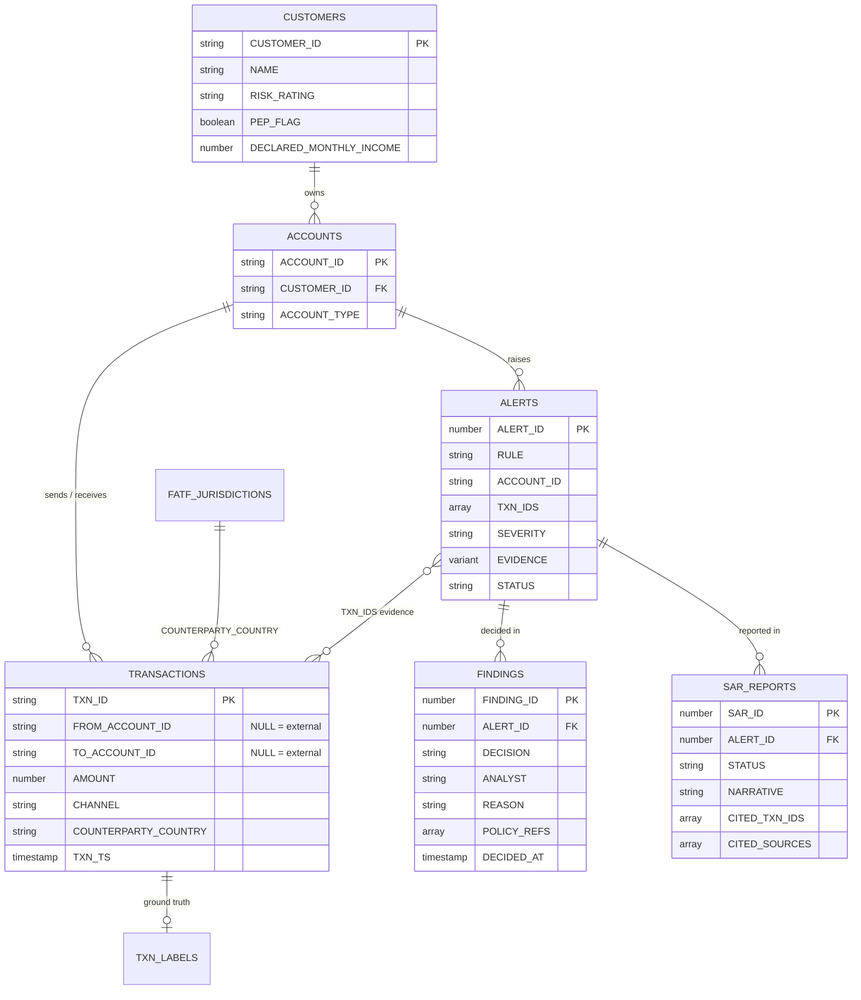

# Risk Copilot — Fraud, AML & Regulatory Intelligence on Snowflake

Snowflake CoCo CLI Hackathon 2026 (GCC Edition) — Problem Statement #1:
*"Build a copilot that surfaces risk and fraud signals and produces audit-ready regulatory
outputs from natural language questions."*

**Team cypher:** Sai Pranav · Udith

---

## 1. The problem

An AML analyst at a GCC risk-ops centre supporting a global bank works an alert like this:

1. A monitoring system flags an account.
2. The analyst pulls its transactions from one system, the customer's KYC profile from another.
3. They look up the bank's AML policy and the FinCEN / FATF guidance to decide whether the
   activity actually breaches anything.
4. They write up a decision, and if it is suspicious, a Suspicious Activity Report (SAR).
5. Months later an auditor asks *"why did you decide that?"*, and every step must be traceable.

That takes hours per alert, most alerts are false positives, and the reasoning usually lives
in someone's head or a spreadsheet.

**Risk Copilot runs the whole flow inside Snowflake, driven from the CoCo CLI:**

```
   SIGNAL            →        EVIDENCE           →      FINDING          →      REPORT
 deterministic rules     transactions + KYC +       analyst decision,      SAR draft citing
 raise an alert          cited policy clauses       append-only log        every fact it uses
```

### Who uses it

| Persona | What they do here |
|---|---|
| **AML analyst** (daily user) | Works the alert queue, investigates, escalates or dismisses |
| **Compliance officer** | Reviews escalations, approves and files SARs |
| **Auditor** | Read-only: sees every decision and its evidence, with customer PII masked |
| **Risk / compliance lead** (buyer) | Rule performance, alert volumes, time to disposition |

---

## 2. Design principles

1. **The LLM never decides what is fraud.** Detection is deterministic SQL and Snowpark, written
   down in policy clauses. The AI explains evidence and drafts text; a named human decides.
2. **Every claim cites its source.** A transaction ID, or a policy / regulation clause retrieved
   by Cortex Search. A statement with no citation is not allowed in an answer or a SAR.
3. **Decisions are append-only.** Analyst dispositions go to a `FINDINGS` log that the analyst
   role can insert into but never update or delete.
4. **Measured, not claimed.** Every rule is scored for precision and recall against hidden
   ground-truth labels that the rules themselves never read.
5. **Everything stays in Snowflake.** Data, detection, retrieval, AI, governance and the app
   run in one account. Nothing leaves it.

---

## 3. High-level architecture



Requests flow top to bottom; every layer runs inside one Snowflake account.

| Layer | Snowflake features | Status |
|---|---|---|
| 1 · Data | Stages, `COPY INTO`, tables, file formats | Built, tested locally |
| 2 · Detection | SQL, Snowpark Python stored procedure | Built, tested locally |
| 3 · Evidence | Cortex Search, `AI_PARSE_DOCUMENT`, `SPLIT_TEXT_MARKDOWN_HEADER` | Written, not yet run |
| 3 · Evidence | Semantic view, Cortex Analyst, Cortex Agent | Planned |
| 4 · Finding | Tables + role grants (append-only) | Written, not yet run |
| 5 · Governance | Masking policies, RBAC roles, tags | Planned |
| App | Streamlit in Snowflake | Planned |
| Interface | CoCo CLI project skills (`.cortex/skills/`) | Written, not yet run |

---

## 4. Pipelines

### 4.1 Data pipeline — raw files to the data contract



Raw files are loaded **unchanged**; one SQL step maps them onto the contract every other
component depends on. A new data source only needs a new mapping, never a rule change.

What `02_canonical.sql` does:

| Raw shape | Canonical shape | Rule |
|---|---|---|
| One-sided row: `account_id` + `counterparty_account` | `FROM_ACCOUNT_ID` → `TO_ACCOUNT_ID` | `deposit` or "incoming…" description = inflow; otherwise outflow. External side is `NULL` |
| `txn_type` + `channel` + description | `CHANNEL` = CASH / WIRE / INTERNAL / UPI / ACH | "cash…" description, or deposit/withdrawal at ATM/branch = CASH |
| `kyc_risk_rating`, `expected_monthly_volume` | `RISK_RATING`, `DECLARED_MONTHLY_INCOME` | Upper-cased; volume is the §7.3 income baseline |
| Generator typology names | `TYPOLOGY` | `RAPID_LAYERING` → `LAYERING`, `ROUND_TRIPPING` → `ROUND_TRIP`, … |
| `currency = INR` | `CURRENCY = USD` | Typologies are sized for US BSA thresholds; see `data/README.md` |

### 4.2 Detection pipeline — transactions to alerts



| Rule | Policy | Logic | Severity |
|---|---|---|---|
| `STRUCTURING` | §3.3 | ≥3 cash deposits of $8,000–$9,999 within 7 days, total > $10,000 | HIGH |
| `VELOCITY` | §4.1 | ≥4 transactions in any rolling 24h, value > 5× trailing 90-day daily average, min $10,000 | MEDIUM; HIGH if no prior activity |
| `PASS_THROUGH` | §5.5 | Inflow ≥ $50,000, then ≥2 outflows totalling ≥50% of it within 72h | HIGH |
| `GEO_RISK` | §6.2 | Any wire with a FATF black-list country; grey-list wires > $50,000 in 30 days | CRITICAL / HIGH |
| `ROUND_TRIP_CYCLE` | §5.2 | Money leaves and returns through 2–4 time-ordered hops within 7 days, each hop ≥80% of the last | MEDIUM (2 hops) / HIGH (3+) |

Properties every rule shares:
- **Idempotent:** each rule deletes its own rows and re-inserts, so the whole pipeline can rerun.
- **Explainable:** `EVIDENCE` stores the numbers that fired it (totals, multiples, window, policy clause).
- **Traceable:** `TXN_IDS` stores the exact transactions, so every alert links to raw evidence.
- **Severity bump is a view, not an update:** reruns never escalate the same alert twice.

**Why the cycle rule is Python, not SQL.** Finding A→B→C→A where each transfer happens *after*
the previous one is a graph search with time constraints. `detection/cycles.py` runs a bounded
depth-first search over time-ordered edges. The idea comes from Pranav's Arbix project
(Bellman-Ford cycle detection), but Bellman-Ford ignores time order and would report loops
money could not actually have travelled. It runs as a Snowpark stored procedure, so data never
leaves Snowflake.

### 4.3 Evidence pipeline — documents to citations



Chunks keep their **source file and section header**, so an answer can cite
*"internal_aml_policy.pdf, §3 Structuring"* rather than paste anonymous text.

The internal policy (`corpus/internal_aml_policy.md`) is a fictional bank's monitoring policy
written for this project. Every detection rule is a numbered clause in it, which is what
lets the copilot say *which rule* an account broke and *where that rule is written down*.

---

## 5. The analyst process — signal to SAR



| Step | Who decides | What is recorded |
|---|---|---|
| Alert raised | A deterministic rule | `ALERTS`: rule, txn ids, evidence numbers, policy clause |
| Investigation | Nobody: evidence is gathered and explained | Nothing new, read-only |
| Disposition | The **analyst**, by name, with a reason | `FINDINGS`: decision, analyst, reason, evidence txns, clauses, role, timestamp |
| SAR draft | The AI drafts, **only after** a human escalation | `SAR_REPORTS`: narrative, cited txns, cited sources, status `DRAFT` |
| Filing | The **compliance officer** | `SAR_REPORTS.STATUS` → `APPROVED` / `FILED` |

### CoCo skills

Project skills live in `.cortex/skills/` and are called as `$skill-name`
([CoCo extensibility docs](https://docs.snowflake.com/en/user-guide/cortex-code/extensibility)).

| Skill | Input | Does | Writes |
|---|---|---|---|
| `$aml-detect` | — | Runs all rules + cycle proc; summarises queue; shows precision/recall on request | `ALERTS` |
| `$aml-investigate` | `ALERT_ID` | Pulls txns, KYC, linked alerts, policy + regulation clauses; explains with citations; records the analyst's decision | `FINDINGS`, `ALERTS.STATUS` |
| `$sar-draft` | escalated `ALERT_ID` | Refuses unless a human escalated it; drafts a FinCEN-structured narrative with a citation on every claim | `SAR_REPORTS` |

---

## 6. Data model



### Data contract

All detection, the semantic model and the app depend on these names. All amounts in **USD**.

```
CUSTOMERS    (CUSTOMER_ID, NAME, CUSTOMER_TYPE, RISK_RATING, PEP_FLAG, OCCUPATION,
              DECLARED_MONTHLY_INCOME, COUNTRY, ONBOARDED_AT)
ACCOUNTS     (ACCOUNT_ID, CUSTOMER_ID, ACCOUNT_TYPE, OPENED_AT, STATUS)
TRANSACTIONS (TXN_ID, FROM_ACCOUNT_ID, TO_ACCOUNT_ID, COUNTERPARTY_REF, AMOUNT, CURRENCY,
              CHANNEL, ACCESS_POINT, COUNTERPARTY_COUNTRY, TXN_TS, DESCRIPTION)
             -- FROM/TO = internal ACCOUNT_ID, or NULL for the external side
             -- cash deposit = FROM NULL, TO the account, CHANNEL 'CASH'
             -- CHANNEL in (CASH, WIRE, ACH, UPI, INTERNAL)
             -- COUNTERPARTY_COUNTRY = ISO-2 code, matches FATF_JURISDICTIONS
TXN_LABELS   (TXN_ID, ACCOUNT_ID, TYPOLOGY)  -- ground truth; detection never reads it
```

---

## 7. Governance (planned)

| Control | Implementation | Shows in the demo as |
|---|---|---|
| PII masking | Masking policy on `CUSTOMERS.NAME`, account IDs; tag-based | Auditor role sees `***MASKED***` |
| Least privilege | Roles `AML_ANALYST`, `COMPLIANCE_OFFICER`, `AUDITOR` | Switching role changes what is visible |
| Append-only decisions | `AML_ANALYST` gets `INSERT, SELECT` on `FINDINGS`, never `UPDATE/DELETE` | A decision cannot be rewritten |
| Ground-truth isolation | No detection role can read `TXN_LABELS` | Evaluation is honest |
| Point-in-time evidence | Time Travel on `TRANSACTIONS`, `ALERTS` | What the analyst saw when they decided |

---

## 8. Evaluation

The generator plants known typologies and records them in `TXN_LABELS`. Only
`sql/30_evaluate.sql` reads that table. `RULE_METRICS` reports, per rule:

| Metric | Meaning |
|---|---|
| `PRECISION` | Alerts that contain at least one truly suspicious transaction / all alerts |
| `TYPOLOGY_PRECISION` | Same, but the label must match the rule's own typology. Lower for velocity by design: a spike on a cycle or FATF account is a real catch under another name |
| `CASE_RECALL` | Labelled accounts with at least one transaction in a matching alert / labelled accounts. **The headline number:** one alert per scheme is enough for an analyst |
| `RECALL` | Same at transaction level. Understates bursts longer than the rule window |

### Results on `data/` (41,492 transactions, 168 labelled)

| Rule | Alerts | Precision | Cases caught |
|---|---|---|---|
| STRUCTURING | 12 | 1.00 | 12 / 12 |
| VELOCITY | 32 | 0.75 | 12 / 12 |
| PASS_THROUGH | 14 | 0.93 | 10 / 11 |
| ROUND_TRIP_CYCLE | 4 | 1.00 | all 4 cycles (12 accounts) |
| GEO_RISK | 6 | 1.00 | 6 / 6 |

The one miss is a layering account that passed on 47.9% of its inflow, under the 50% rule
threshold. **Caveat:** velocity and pass-through thresholds were calibrated on this file, so
these numbers are optimistic. Final numbers come from a second, differently seeded file that
no threshold was tuned against.

---

## 9. Running it

### On Snowflake

```sql
-- from the repo root, in CoCo or SnowSQL
PUT file://data/*.csv          @RAW_DATA   AUTO_COMPRESS=TRUE  OVERWRITE=TRUE;
PUT file://detection/cycles.py @CODE_STAGE AUTO_COMPRESS=FALSE OVERWRITE=TRUE;
PUT file://corpus/*.pdf        @REG_DOCS   AUTO_COMPRESS=FALSE OVERWRITE=TRUE;
```

Then run, in order:

```
01_load_raw → 02_canonical → 05_reference → 10_alerts_and_cycle_proc
            → 20_detection_rules → 30_evaluate → 40_cortex_search → 50_findings
```

Then in CoCo:

```
$aml-detect
$aml-investigate <ALERT_ID>
$sar-draft <ALERT_ID>
```

### Locally, no Snowflake needed

The real SQL files run on DuckDB; only Snowflake-only functions are translated (`tests/duck.py`).

```
pip install duckdb
python3 detection/cycles.py           # cycle detector self-check
python3 tests/test_rules_duckdb.py    # every rule on planted typologies, asserts case recall 1.0
python3 tests/run_on_data.py          # full pipeline on data/, prints RULE_METRICS
```

---

## 10. Repository layout

| Path | What | Owner |
|---|---|---|
| `data/` | Generated synthetic data + mapping notes (`data/README.md`) | Udith |
| `sql/01_load_raw.sql` | Stage + `COPY INTO` raw tables | Pranav |
| `sql/02_canonical.sql` | Raw → data contract | Pranav |
| `sql/05_reference.sql` | FATF black/grey list + bank's own high-risk list | Pranav |
| `sql/10_alerts_and_cycle_proc.sql` | `ALERTS` table + registers the cycle proc | Pranav |
| `sql/20_detection_rules.sql` | Four SQL rules, `ALERT_QUEUE`, `ALERT_TXNS` | Pranav |
| `sql/30_evaluate.sql` | `RULE_METRICS` against ground truth | Pranav |
| `sql/40_cortex_search.sql` | Parse, chunk, index the corpus | Pranav |
| `sql/50_findings.sql` | `FINDINGS`, `SAR_REPORTS` | Pranav |
| `detection/cycles.py` | Round-trip / layering cycle search (Snowpark handler) | Pranav |
| `.cortex/skills/` | `aml-detect`, `aml-investigate`, `sar-draft` | Pranav |
| `corpus/` | Policy + FinCEN/FATF documents for Cortex Search | Pranav |
| `tests/` | DuckDB harness, planted-typology test, real-data run | Pranav |
| `docs/brief.txt` | Submission brief (≤1024 characters) | both |

### Corpus sources

| File | Source |
|---|---|
| `internal_aml_policy.md` / `.pdf` | Written for this project (fictional bank). The PDF is what gets indexed |
| `fincen_sar_narrative_guidance.pdf` | FinCEN, *Guidance on Preparing a Complete & Sufficient SAR Narrative* |
| `fincen_sar_filing_instructions.pdf` | FinCEN, SAR Electronic Filing Instructions |
| *to add by hand* | FATF Recommendations; current FATF high-risk & monitored jurisdictions; FATF *Professional Money Laundering* (fatf-gafi.org blocks scripted downloads) |

---

## 11. Status and roadmap

| | Item |
|---|---|
| ✅ | Data load + canonical mapping, tested on the real generated data |
| ✅ | Five detection rules + cycle search, tested locally with precision/recall |
| ✅ | Evaluation against ground truth |
| 📝 | Cortex Search, findings tables, CoCo skills: written, awaiting the Snowflake account |
| ⏳ | Semantic view + Cortex Analyst + Cortex Agent (natural-language questions over the data) |
| ⏳ | Masking policies + roles |
| ⏳ | Streamlit command centre |
| ⏳ | Held-out evaluation on a second generated dataset |

**Beyond the hackathon:** case-management integration, analyst feedback feeding threshold
tuning, regulator-format export (FinCEN BSA XML), RBI / FIU-IND STR as a second jurisdiction,
ML risk scoring behind the deterministic rules (explainable boosting, never a black box).

---

*Synthetic data only. No real customers, accounts or personal data. AI-generated
explanations and drafts are decision support; filing decisions rest with named humans.*
